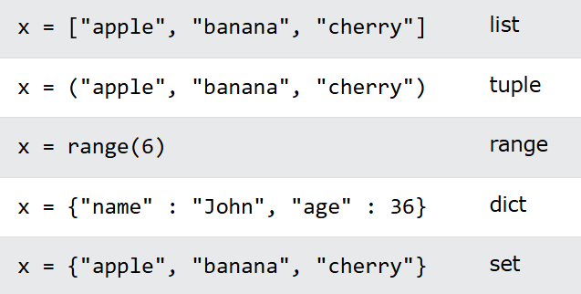

# Day 1: Variables and Data types in Python
## Python Indentation
Indentation refers to the spaces at the beginning of a code line.

Where in other programming languages the indentation in code is for readability only, the indentation in Python is very important.

Python uses indentation to indicate a block of code.
```
if 5 > 2:
 print("Five is greater than two!") 
```
## Comments
### Single line comment:

For single line commant use #

### Multiline comment:
```
"""
This is a comment
written in
more than just one line
"""
```

## Variables
Variables are containers for storing data values.

## Creating Variables
Python has no command for declaring a variable.

A variable is created the moment you first assign a value to it.

```
x = 4       # x is of type int
x = "Sally" # x is now of type str
x=str(2)    # x is now of type str
print(type(x))
```

## Single or Double Quotes?
String variables can be declared either by using 
single or double quotes:

```
y='john'
print(type(y))
y="jon"
print(type(y))
```

## Case-Sensitive
Variable names are case-sensitive.

Example
This will create two variables:
```
a = 4
A = "Sally"
#A will not overwrite a
```

## Rules for Python variables:

A variable name must start with a letter or the underscore character
A variable name cannot start with a number
A variable name can only contain alpha-numeric characters and underscores (A-z, 0-9, and _ )
Variable names are case-sensitive (age, Age and AGE are three different variables)
A variable name cannot be any of the Python keywords

## Multi Words Variable Names

### Camel Case
Each word, except the first, starts with a capital letter:
```
myVariableName = "John"
```
### Pascal Case
Each word starts with a capital letter:
```
MyVariableName = "John"
```
### Snake Case
Each word is separated by an underscore character:
```
my_variable_name = "John"
```
### Unpack collection

```
fruits = ["apple", "banana", "cherry"]
x, y, z = fruits
print(x)
print(y)
print(z)
```

### Output Variables
The Python print() function is often used to output variables.
```
x = "Python is awesome"
print(x)
```

```
x = "Python"
y = "is"
z = "awesome"
print(x, y, z)
```
### You can also use the + operator to output multiple variables:
```
x = "Python "
y = "is "
z = "awesome"
print(x + y + z)
```
### In the print() function, when you try to combine a string and a number with the + operator, Python will give you an error:

```
x = 5
y = "John"
print(x + y)
```

## Global Variables
```
x = "awesome"

def myfunc():
  print("Python is " + x)

myfunc()
```
### Local vs global variable

```
x = "awesome"

def myfunc():
  x = "fantastic"
  print("Python is " + x)

myfunc()

print("Python is " + x)
```

### How to create a global variable inside a function

```
def myfunc():
  global x
  x = "fantastic"

myfunc()

print("Python is " + x)
```
```
x = 'awesome'
def myfunc():
  x = 'fantastic'
myfunc()
print('Python is ' + x)
```
## Built-in Data Types
In programming, data type is an important concept.

Variables can store data of different types, and different types can do different things.

## Python has the following data types built-in by default, in these categories:

Text Type:	str
Numeric Types:	int, float, complex
Sequence Types:	list, tuple, range
Mapping Type:	dict
Set Types:	set, frozenset
Boolean Type:	bool
Binary Types:	bytes, bytearray, memoryview
None Type:	NoneType

